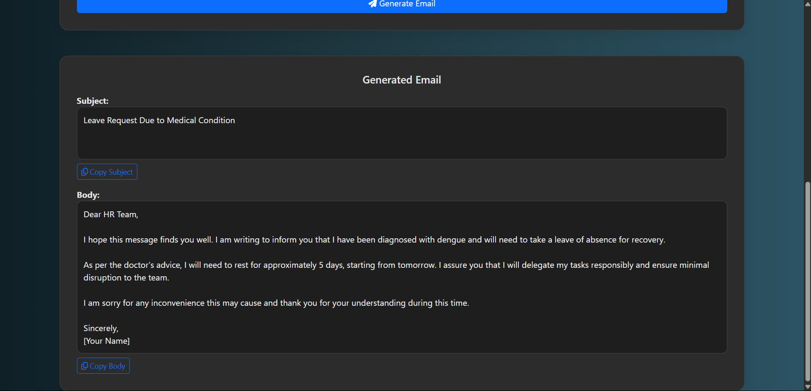

# AI Email Generator using Generative AI (OpenAI + LangChain + Flask)

This Flask-based web application generates professional, personalized emails using OpenAI through LangChain. It leverages a Retrieval-Augmented Generation (RAG) approach, retrieving relevant email templates from a FAISS vector store for context-aware email generation.


## Features

- Generates emails based on user input (prompt, recipient, tone, and length).
- Uses RAG with FAISS for context-aware email generation.
- Supports formal and informal tones with customizable email lengths.
- Provides an editable and copyable email subject and body.
- Simple, responsive UI built with Bootstrap.

## Tech Stack

- **Frontend**: HTML, CSS (Bootstrap)
- **Backend**: Python, Flask
- **AI/LLM**: OpenAI via LangChain
- **Vector Store**: FAISS
- **Environment Management**: `python-dotenv`

## Installation & Setup

### 1. Clone the Repository
```bash
git clone https://github.com/your-username/ai-mail-generator.git
cd ai-mail-generator
```

### 2. Create and Activate a Virtual Environment

#### Windows

```bash
python -m venv venv
venv\Scripts\activate
```

---

#### macOS

```bash
python3 -m venv venv
source venv/bin/activate
```

---

#### Linux (Ubuntu)

```bash
python3 -m venv venv
source venv/bin/activate
```

### 3. Install Dependencies
```bash
pip install -r requirements.txt
```

### 4. Prepare Email Templates
- Create an `email_templates.txt` file in the project root with sample email templates (optional, as the app includes default templates).
- Example format for `email_templates.txt`:
  ```
  Formal Business Inquiry:
  Subject: Business Inquiry from [Your Name]
  Dear [Recipient Name],
  ...

  Informal Job Application:
  Subject: Application for [Position Name] - Let's Connect!
  Hey [Hiring Manager's Name],
  ...
  ```




## File Structure
```
├── app.py                    # Main Flask application
├── templates/
│   └── index.html            # Web interface template
├── email_templates.txt       # Predefined email templates (optional)
├── .env                      # Environment variables
├── requirements.txt          # Python dependencies
└── README.md                 # Project documentation
```

## Running the App
```bash
python app.py
```
Access the app at: 🔗 `http://localhost:10000`

## Example Usage
1. Open the web interface at `http://localhost:10000`.
2. Fill in the form:
   - **Prompt**: Describe the email's purpose (e.g., "Inquire about a product").
   - **Recipient**: Name of the recipient.
   - **Tone**: Select "Formal", "Informal", "Harsh" or even "Urgent" .
   - **Length**: Choose "Short" (50-100 words), "Medium" (100-200 words), or "Long" (200-300 words).
3. Submit the form to generate the email.
4. Edit or copy the generated subject and body directly from the interface.


## How It Works
- The app loads email templates from `email_templates.txt` (or uses defaults if not found).
- Templates are split into chunks using `CharacterTextSplitter` and indexed in a FAISS vector store with `OpenAIEmbeddings`.
- Upon form submission:
  - The app retrieves relevant templates using the user's prompt.
  - The OpenAI LLM generates a personalized email via a `PromptTemplate`.
- The output is displayed in a clean Bootstrap interface with options to edit or copy.

## Dependencies
- Flask
- python-dotenv
- langchain
- openai
- langchain-community
- faiss-cpu
- langchain-openai

Install with:
```bash
pip install -r requirements.txt
```

## Troubleshooting
- **Error: "email_templates.txt not found"**: Create the file in the project root or rely on default templates.
- **Error: API key issues**: Verify your OpenAI API key in `.env` and ensure it has the necessary permissions.
- **Error: Port conflict**: Update the `PORT` variable in `.env` or `app.py`.

## Resources
- [LangChain Documentation](https://www.langchain.com/)
- [Bootstrap](https://getbootstrap.com/)
- [FAISS](https://github.com/facebookresearch/faiss)


